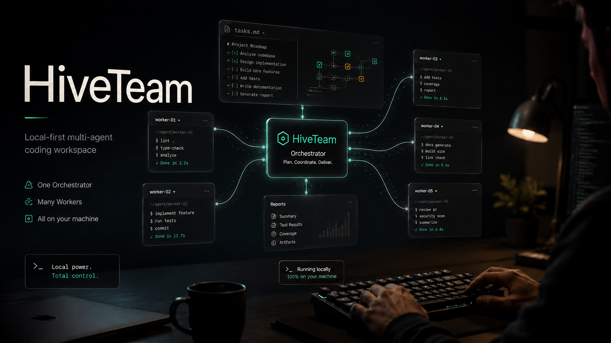

<p align="center">
  
</p>

# HiveTeam

<p align="center">
  
</p>

**HiveTeam 是浏览器里的 Agent 协作工作台——一群 Agent 在你本机各自开工，一个当 Orchestrator 派活、归总进展，其余各司其职。** Orchestrator 本身就是一个真实的 `agy` / `claude` / `codex` / `opencode` / `gemini` / `hermes` / `qwen` 进程——不是你、也不是脚本——它派单的 Worker 同样是真 CLI agent。所有 agent 都是本机真实的 PTY 进程，通过 HiveTeam 注入到 shell 里的小型 `team` 协议互相通信，共享 `<workspace>/.hive/tasks.md` 这份 markdown 任务图。

写代码、做调研、起草文档、做翻译——凡是能拆给一群人协作的脑力活，都可以让一群 Agent 合伙干。

[](https://github.com/zhouyuanxinand/hiveteam/actions/workflows/release.yml)
[](https://nodejs.org/)
[](./LICENSE.BSL)
[-lightgrey.svg)](#平台支持)

[English](./README.md) · 简体中文

> 这是一个由 Git 源码驱动的自托管 Hive 分支，默认只监听 `127.0.0.1`，不会查询 npm 或原版 Hive 的更新渠道。
>
> 构建和更新都以你选中的 Git 提交为准，运行代码与源码保持一致。

<p align="center">
  
</p>

## 为什么需要 HiveTeam

CLI Agent 各自都很强，但同时管几个就有点别扭：

- 长任务的会话散在好几个终端里，注意力来回切。
- 想把活儿分给几个 Agent（写代码 / review / 测试，或者调研 / 起草 / 事实核查之类），却缺一层来居中调度。
- Worker 的进度淹在 scrollback 里，回头看找不到。
- 想重启接着干，全看每个 CLI 自己的 session 恢复行为，散乱不可控。

Hive 加上这一层调度，**不替换**任何 CLI。Agent 还是真实跑在你电脑上的终端进程，Hive 只是它们外面的"团队 shell"。

## 三个开箱场景

**带 reviewer 发一个 PR**

让 Orchestrator 先拆任务，再派一个 worker 实现、一个 worker review。实现、反馈、返工和最终汇报都留在同一个 workspace 里，不用在几个终端之间来回找上下文。

```text
修复设置页搜索 bug。派一个 worker 实现，再派一个 reviewer 检查边界情况，最后汇总还能不能合。
```

**并行排查一个疑难 bug**

把同一个问题拆成几条线：server 链路、UI 链路、最近提交、复现路径分别交给不同 worker。你看的是逐条 report 回流，而不是手动盯四个终端。

```text
排查移动端 reconnect 偶发卡住。把 server transport、浏览器 UI 和最近提交历史拆给不同 worker。
```

**调研、起草、事实核查一条龙**

一个 worker 找资料，一个 worker 起草，一个 reviewer 核对命令、文件路径和结论。任务图和汇报都可追踪，不会散在 chat scrollback 里。

```text
写一篇 release flow 技术说明。一个 worker 收集证据，一个起草，一个核对每个命令和文件引用。
```

## 先看看 demo

还没装任何 agent CLI？运行 `hive`、打开它打印出的本地地址、在 first-run 向导里点 **Try Demo**。你会看到一个完全跑在客户端的预览——假 orchestrator + 两个 worker、预录的终端 scrollback、一份预填的任务清单——既不会连服务器，也不需要任何真实 CLI agent。适合决定要不要继续装真 CLI。

## 快速开始

前置条件：

- Node.js 22 或更新版本
- 至少一个支持的 Agent CLI 已经安装好、登录过、在 `PATH` 上可调用

克隆、安装并启动本分支：

```bash
git clone https://github.com/zhouyuanxinand/hiveteam.git
cd hiveteam
pnpm install
pnpm dev
```

安装时如果看到 `npm warn allow-scripts` 或 `prebuild-install@7.1.3 deprecated`，先看最后是否显示 `added ... packages`。这些 warning 多数来自 npm 对安装脚本的安全审查，以及 `node-pty` / `better-sqlite3` / `esbuild` 这类原生依赖的二进制安装链路；不代表 Hive 启动失败。下面的故障排查里有逐项解释。

打开终端打印出来的本机地址，通常是 `http://127.0.0.1:3000/`。如果你想指定端口，可以用 `hive --port 4010`。

更新源码驱动的构建：

```bash
git pull origin main
pnpm install --frozen-lockfile
pnpm build
```

重建后重启正在运行的 Hive。兼容保留的 `hive update` 命令只会提示本地源码更新方式，不会从 npm 安装任何内容。

把 Hive 装为应用（可选）：

在 Chrome / Edge / Brave 里打开 `http://127.0.0.1:3000/`，点浏览器地址栏右侧的安装图标即可。装好后 Hive 会以独立窗口启动、有自己的 dock 图标，且 dock 右键菜单上会显示 **添加 Workspace** / **试用演示** 两个快捷入口。Firefox 和 Safari 暂未实现 PWA install-prompt 协议，浏览器地址栏的安装图标只在 Chromium 系浏览器里出现。

PWA 只是 UI 壳，Hive 后端仍需要在终端里跑着。如果启动 PWA 时后端没起，会看到 “Hive 后端未启动” 页面，等你跑起 `hive` 后会自动刷新。PWA 的 install scope 按 origin（含端口）划分，所以 `hive --port 4011` 跟 `hive --port 3000` 在浏览器看来是两个独立应用。卸载方法：浏览器地址栏访问 `chrome://apps`，右键 Hive 图标，选 **从 Chrome 中移除…**。

关闭 PWA 窗口或 tab 时 Hive 会主动请求浏览器弹原生确认对话框，避免关闭快捷键（macOS 上是 Cmd+W、Windows / Linux 上是 Ctrl+W）误关丢失会话。但现代浏览器要求你跟页面"交互过"（点击 / 滚动 / 输入）才会真的弹这个对话框——刚打开 PWA 立刻按关闭快捷键仍会直接关闭，这是浏览器策略，不是 Hive 的 bug。

首次使用流程：

1. 选择一个项目目录作为 workspace。
2. 挑一个 Orchestrator 预设。
3. Hive 会创建 `<workspace>/.hive/tasks.md`，启动 Orchestrator 的 PTY，把内部的 `team` 命令注入这个 agent 会话。
4. 在 Team Members 面板里添加 Worker。
5. 跟 Orchestrator 说一声让它派活，它会用 `team send <worker-name> "<task>"` 发任务，Worker 完事后用 `team report` 回报。

想让 Orchestrator 自己决定团队规模，可以保留 **自动组队** 开关开启（默认开启）：它会按任务需要临时 `team spawn` 合适数量的 coder / tester / reviewer，任务结束后自动收回临时成员。

想试更强的自动化，可以在右上角设置里开启实验性的 **Workflow** 开关。开启后，Orchestrator 可以编写并运行多 agent workflow，把一个目标拆成 fan-out / review / test 等阶段；顶部的 **Workflows** 面板会显示运行记录、阶段结果、定时任务和停止按钮。Workflow 创建的新 agent 默认使用哪种 CLI、允许使用哪些 CLI，也可以在 Workflows 面板里配置。

## 工作方式

```text
浏览器 UI 跑在 127.0.0.1
  任务 · 团队 · 终端 · 汇报
          |
          | HTTP + WebSocket
          v
Hive Runtime
  SQLite 元数据 · PTY 生命周期 · 任务派单
          |
          +-- Orchestrator PTY
          |     可调用：team send、team list、team report
          |
          +-- Worker PTY
          |     可调用：team report
          |
          +-- Worker PTY
                可调用：team report

Workspace 任务图：
  <workspace>/.hive/tasks.md
```

三个细节值得记住：

- Agent 是真正的 CLI 进程，不是模拟的 subagent。
- `team` 命令**只**在 Hive 管理的 agent 会话里可用——通过把包内 bin 目录 prepend 到 PATH 实现，不会装成全局命令。
- 任务图就是 workspace 里的一份 markdown 文件，你可以在编辑器里直接看或者改。

## Agent 预设

| 预设 | `PATH` 上的命令 | 默认 bypass 模式 | 会话恢复 |
| --- | --- | --- | --- |
| Antigravity CLI | `agy` | `--dangerously-skip-permissions` | `--conversation <session_id>` |
| Claude Code | `claude` | `--dangerously-skip-permissions`、`--permission-mode=bypassPermissions` | `--resume <session_id>` |
| Codex | `codex` | `--dangerously-bypass-approvals-and-sandbox` | `resume <session_id>` |
| OpenCode | `opencode` | 由 `~/.config/opencode/opencode.json` 配置 | `--session <session_id>` |
| Gemini | `gemini` | `--yolo` | `--resume <session_id>` |
| Hermes | `hermes` | `--yolo` | `--resume <session_id>` |
| Qwen Code | `qwen` | `--approval-mode yolo` | `--resume <session_id>` |
| Cursor CLI | `cursor` | `--force` | 暂未自动捕获 session id |
| Grok Build | `grok` | `--always-approve` | 暂未自动捕获 session id |
| 自定义 | 任意可执行文件 | 自己配 | 自己配 |

Hive 不替你安装这些 CLI。请在启动 Hive 的同一个 shell 环境里先装好、登录好。

## Hive 提供什么

- Workspace 侧边栏，方便在多个本机项目之间切换。
- Orchestrator 和 Worker 终端都是真实 PTY 支撑的。
- Add Worker 预置 coder / reviewer / tester 等角色模板，也支持完全自定义 prompt 与命令——把任何 CLI agent 编排成你需要的角色。
- 自动组队（实验性，默认开启）：Orchestrator 可以根据任务动态创建临时 coder / tester / reviewer，完成后自动回收。
- Workflows（实验性，默认关闭）：Orchestrator 可以运行多阶段、多 agent 的 workflow，Hive 在 Workflows 面板里展示运行、日志、结果、定时任务和停止控制。
- Workflow CLI 策略：为 workflow 创建的 agent 选择默认 CLI，并限制允许使用的 CLI，避免脚本误启未配置的 agent。
- 团队记忆：把 workspace 约束、长期上下文和团队共识留在 Hive 里，后续派单时更容易把背景带给正确的 agent。
- 派单改动审查：在 Git 工作区里，Hive 会在创建派单时记录 HEAD 提交，活动中心可以查看该派单处理期间产生的工作区 diff（含新增未跟踪文件），不必再盲信成员的口头汇报；审查反馈可以直接发回该成员的终端，派单会重新打开、让成员改完再次汇报。
- `.hive/tasks.md` 编辑器，带外部文件冲突处理。
- PTY 后台保留 + 尽力使用各 CLI 原生 session 恢复。
- 升级后的 What's New 弹窗，用简短 release highlights 告诉你新版改了什么。
- 元数据存在本机 SQLite，Windows 默认在 `%APPDATA%\hive`，macOS / Linux 默认在 `~/.config/hive`，也可以通过 `$HIVE_DATA_DIR` 指定。

Hive **不**提供 sandbox 隔离、多用户认证，也不自带任何 agent 模型。它只负责调度你已经在用的本机 CLI。

## 远程访问（可选，默认关闭）

如果想在外面用手机查看、操作正在本机跑着的 Hive，可以开启可选的 **Remote access**。开启后，手机浏览器登录、跟桌面完成一次配对，就能通过端到端加密隧道访问 Hive Web UI。已配对的手机是与本地浏览器**等权**的受信任设备。

需要清楚的几点：

- **默认关闭**。不开就没有远程通路，行为仍然是本机优先。
- **需要一个网关**。Hive 通过网关中转手机和本机 daemon 的连接；本机主动出站连接，不要求你打开公网端口。
- **数据和执行永远在本机**。网关只负责登录后的路由与中转，不运行你的 agent，也不保存 workspace 内容。
- **信任根在桌面**。新设备配对必须人在电脑前确认；已配对手机不能凭自己批准新设备。设备随时可吊销。

## 平台支持

所有平台都需要 Node.js 22+。Hive 依赖 `node-pty` 和 `better-sqlite3` 这类原生包，没有预编译二进制时需要你本机有原生构建工具链。

## 安全模型

Hive 是本机开发工具，**不是**托管服务。

- Remote access 关闭时，runtime 只监听 `127.0.0.1`。不要把 Hive 端口通过公网隧道、反向代理或任何共享网络接口暴露出去。
- Remote access 开启后，已配对手机与本地浏览器等权；只给你信任的设备配对，不用时及时关闭或吊销。
- 内置预设会主动传 CLI 的 non-interactive / bypass flag。Worker 在选中的 workspace 里有跟启动 shell **同等**的执行权限——把它当成"会自动跑命令的你自己"。
- 只打开你信任的 workspace。Worker 拥有跟你登录账户一样的文件系统访问权限。
- Agent token 是 session 级的，由本机 runtime 生成，注入到 agent 进程环境变量里，**不**用于跨网络通信。
- Hive 不做多用户认证。任何能从本机访问到端口的进程都视为可信本地访问。
- 浏览器 UI token 只是本机会话保护，不是用来防同一系统账户下其他进程的安全边界。

在敏感仓库里用 Hive 之前，请先读 [SECURITY.md](SECURITY.md)。

## 数据位置

| 数据 | 位置 |
| --- | --- |
| Runtime 元数据 | Windows: `%APPDATA%\hive`；macOS / Linux: `~/.config/hive`；或 `$HIVE_DATA_DIR` |
| Workspace 任务图 | `<workspace>/.hive/tasks.md` |
| 内部 `team` 命令 | 包内 `dist/bin/`，通过 PATH 注入 PTY |
| Web UI 资源 | 由 runtime 从包内 `web/dist` 直接服务 |

## 故障排查

**找不到 Agent CLI**

确认选中的命令已经安装好、登录好、在启动 Hive 那个 shell 里能直接调用，且在 `PATH` 上。

**端口被占用**

换个本机端口启动：

```bash
hive --port 4020
```

**拉取后源码变更没有生效**

停止正在运行的 Hive，拉取目标分支、重建并重新启动本地 runtime：

```bash
git pull origin main
pnpm install --frozen-lockfile
pnpm build
node dist/src/cli/hive.js --port 4010
```

如果命令仍然启动全局安装的旧版本，检查 `which hive` / `where hive`，开发时可以直接使用上面的 `node dist/src/cli/hive.js`。

**原生包构建失败**

Hive 依赖 `node-pty` 和 `better-sqlite3`，它们用原生二进制。确认 Node.js 22+，清干净 package manager 缓存，并准备好你平台的构建工具（macOS Xcode CLI、Linux build-essential + python3、Windows VS Build Tools）。

安装时如果看到 `prebuild-install@7.1.3` 的 deprecated warning，可以忽略。它来自 `better-sqlite3` 的原生二进制下载链路，只是上游安装器维护状态提示，不代表 Hive 安装失败，也不会影响运行。

安装成功但看到 npm warning 时，可以按来源判断：

| warning | 来源 | 处理 |
| --- | --- | --- |
| `allow-scripts hiveteam` | Hive 的 postinstall 会修正打包后的 native/PTY helper 权限。 | 安装成功后可忽略。 |
| `allow-scripts better-sqlite3` | SQLite 原生绑定需要下载预编译二进制，失败时会本机构建。 | 安装成功后可忽略；失败再检查构建工具链。 |
| `allow-scripts node-pty` | 终端 PTY 原生绑定需要准备平台二进制。 | 安装成功后可忽略；失败再检查构建工具链。 |
| `allow-scripts esbuild` | esbuild 会校验/选择当前平台的二进制包。 | 安装成功后可忽略。 |

这是 npm 11 的安装脚本审查提示。当前 npm 版本仍是提示性质，未来可能要求用户显式批准这些脚本。你想审查时可以运行 `npm approve-scripts --allow-scripts-pending` 查看待审列表。

**Linux 上目录选择器不弹**

装 `zenity`，或者直接在对话框里粘路径。

**Windows 上目录选择器**

Windows 版默认使用浏览器内的服务器文件系统浏览器来添加 Workspace，不再弹 PowerShell 原生目录选择器。浏览器会从“此电脑”开始列出可访问盘符，所以可以进入 `C:\`、`D:\` 等其他盘；如果目标目录不在浏览器列表里，可以展开“高级：粘贴路径”直接输入绝对路径。

**Windows 上全局 Hive 命令仍然启动旧版本**

开发本分支时直接使用源码构建：

```powershell
pnpm build
node dist/src/cli/hive.js --port 4010
```

使用 `where hive` 找出 PATH 中可能排在本仓库之前的旧全局 shim。

**Codex 终端在 Windows 上无法滚动**

使用当前 HiveTeam 源码构建并重启。Codex 这种全屏 TUI 本身通常不会显示浏览器原生滚动条，HiveTeam 会把鼠标滚轮 / PageUp / PageDown 转成 Codex 能识别的终端输入；当前源码也包含对旧的 `node.exe ...\@openai\codex\bin\codex.js` 保存启动命令的识别修复。

**Tasks 文件冲突 banner 出现**

Hive 检测到磁盘上的 `.hive/tasks.md` 比 UI 里的新。`Reload` 接受磁盘版本，`Keep Local` 保留 UI 编辑并覆盖保存。

**Worker 卡在 `working` 状态**

Hive 不通过进程活动猜测任务完成。Worker 只有在调 `team report` 时才会回到 `idle`。如果它确实卡了，从 UI 里 Stop 或 Restart。

## 开发

```bash
pnpm install
pnpm dev
```

开发模式下 runtime 跑在 `127.0.0.1:4010`，Vite 跑在 `127.0.0.1:5180`，把 API 和 WebSocket 代理到 runtime。

常用命令：

```bash
pnpm check
pnpm build
pnpm test
```

预演 production 构建：

```bash
pnpm build
node dist/src/cli/hive.js --port 4010
```

Production 模式下 runtime 直接服务构建好的 web UI，不需要单独的 Vite。

## 源码驱动的构建

本分支刻意以 Git 源码为维护入口。应用中没有官方 npm 更新渠道；需要更新时拉取仓库并按自己的节奏重新构建。

## 状态

Hive 目前处于 alpha 阶段，核心流程已可用。本仓库包含多 CLI agent 预设、自动组队、Workflows、团队记忆、PWA 安装和可选 Remote access；当前检出的提交就是运行构建的唯一依据。

## 另一种形态：squad

如果你更喜欢 **纯 CLI、零后台进程、能直接在 SSH 进的远端服务器上跑** 的形态，[squad](https://github.com/mco-org/squad) 是同一个想法的另一条路线——SQLite 当通信层，每个 agent 各自开一个终端。两个项目互不替代，按工作流挑就行：

- **Hive** — 想要可视化工作台、一键重启、侧边栏切 workspace、给团队演示
- **squad** — 活在 tmux 里、SSH 远端开发、不想跑额外后台进程、Windows server

## 鸣谢

Hive 的"模板市场"内置了两份社区角色 prompt 库的快照，两份都按各自上游的 MIT 许可分发：

- 英文版（界面切到 EN 时使用）：[`msitarzewski/agency-agents`](https://github.com/msitarzewski/agency-agents)
- 中文版（界面切到中文时使用）：[`jnMetaCode/agency-agents-zh`](https://github.com/jnMetaCode/agency-agents-zh)

上游内容未做修改，许可证文本保留在 `vendor/marketplace/<lang>/LICENSE`；快照通过 `pnpm sync:marketplace` 在 hive 发版前刷新。

## License

Hive 在 Business Source License 1.1 下开源。个人使用、内部部署、嵌入、fork 都可以；详细边界见 [LICENSE.BSL](LICENSE.BSL)。Hive 名称、logo 和视觉标识的使用边界见 [TRADEMARK.md](TRADEMARK.md)。
