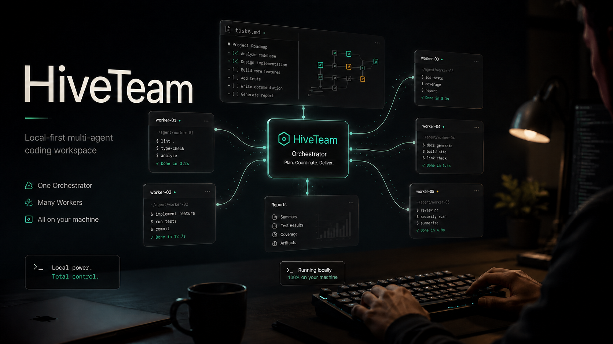

<p align="center">
  
</p>

# HiveTeam

<p align="center">
  
</p>

**HiveTeam 是浏览器里的 Agent 协作工作台——一群 Agent 在你本机各自开工，一个当 Orchestrator 派活、归总进展，其余各司其职。** Orchestrator 本身就是一个真实的 `agy` / `claude` / `codex` / `opencode` / `gemini` / `hermes` / `qwen` 进程——不是你、也不是脚本——它派单的 Worker 同样是真 CLI agent。所有 agent 都是本机真实的 PTY 进程，通过 HiveTeam 注入到 shell 里的小型 `team` 协议互相通信，共享 `<workspace>/.hive/tasks.md` 这份 markdown 任务图。

写代码、做调研、起草文档、做翻译——凡是能拆给一群人协作的脑力活，都可以让一群 Agent 合伙干。

[](https://github.com/zhouyuanxinand/hiveteam/actions/workflows/release.yml)
[](https://nodejs.org/)
[](./LICENSE.BSL)
[-lightgrey.svg)](#平台支持)

[English](./README.md) · 简体中文

> 这是一个由 Git 源码驱动的自托管 Hive 分支，默认只监听 `127.0.0.1`，不会查询 npm 或原版 Hive 的更新渠道。
>
> 构建和更新都以你选中的 Git 提交为准，运行代码与源码保持一致。

<p align="center">
  
</p>

## 为什么需要 HiveTeam

CLI Agent 各自都很强，但同时管几个就有点别扭：

- 长任务的会话散在好几个终端里，注意力来回切。
- 想把活儿分给几个 Agent（写代码 / review / 测试，或者调研 / 起草 / 事实核查之类），却缺一层来居中调度。
- Worker 的进度淹在 scrollback 里，回头看找不到。
- 想重启接着干，全看每个 CLI 自己的 session 恢复行为，散乱不可控。

Hive 加上这一层调度，**不替换**任何 CLI。Agent 还是真实跑在你电脑上的终端进程，Hive 只是它们外面的"团队 shell"。

## 三个开箱场景

**带 reviewer 发一个 PR**

让 Orchestrator 先拆任务，再派一个 worker 实现、一个 worker review。实现、反馈、返工和最终汇报都留在同一个 workspace 里，不用在几个终端之间来回找上下文。

```text
修复设置页搜索 bug。派一个 worker 实现，再派一个 reviewer 检查边界情况，最后汇总还能不能合。
```

**并行排查一个疑难 bug**

把同一个问题拆成几条线：server 链路、UI 链路、最近提交、复现路径分别交给不同 worker。你看的是逐条 report 回流，而不是手动盯四个终端。

```text
排查移动端 reconnect 偶发卡住。把 server transport、浏览器 UI 和最近提交历史拆给不同 worker。
```

**调研、起草、事实核查一条龙**

一个 worker 找资料，一个 worker 起草，一个 reviewer 核对命令、文件路径和结论。任务图和汇报都可追踪，不会散在 chat scrollback 里。

```text
写一篇 release flow 技术说明。一个 worker 收集证据，一个起草，一个核对每个命令和文件引用。
```

## 先看看 demo

还没装任何 agent CLI？运行 `hive`、打开它打印出的本地地址、在 first-run 向导里点 **Try Demo**。你会看到一个完全跑在客户端的预览——假 orchestrator + 两个 worker、预录的终端 scrollback、一份预填的任务清单——既不会连服务器，也不需要任何真实 CLI agent。适合决定要不要继续装真 CLI。

## 快速开始

前置条件：

- Node.js 22.x（至少 22.18），或 Node.js 24.x
- 执行真实任务时，至少一个支持的 Agent CLI 已安装、已登录且在 `PATH` 上可调用；基础工作区可在安装 CLI 前创建

克隆、安装并启动本分支：

```bash
git clone https://github.com/zhouyuanxinand/hiveteam.git
cd hiveteam
npm install
npm start
```

`npm start` 会同时启动本机 HiveTeam Runtime 和 Vite Web 页面，并自动打开已认证的浏览器窗口，
地址通常是 `http://127.0.0.1:5180/`。原有的 `pnpm dev` 仍可用于
习惯 pnpm 的开发流程。

平台启动器会恢复意外退出的服务。**资源 → 平台恢复** 提供 Windows / macOS 的当前用户登录自启动开关，默认关闭；切换只影响下次登录，正常退出不会立即重启。详见[平台恢复与登录自启动](./docs/platform-recovery.md)。

SQLite 使用 Node 内置的 `node:sqlite`，PTY 使用精确锁定版本的
`@lydell/node-pty` 预编译平台二进制。已构建的运行包无需安装脚本或本机 C/C++
编译工具链。请保留 optional dependencies，包管理器会据此安装对应系统和架构的二进制。

源码构建仍使用 `esbuild` 构建前端，它是当前唯一批准的依赖安装脚本。
可选 Electron 桌面入口有独立的安装和验收步骤。

通过安装包运行时，`hive` 会启动生产页面并自动打开已认证的浏览器窗口。如果你想指定端口，可以用 `hive --port 4010`。
启动器通过有效期 60 秒的一次性链接完成登录，页面登录时会清除地址栏中的引导凭据。
仅打开终端打印的 localhost 地址不会获得新的管理会话。Hive 重启后或换用浏览器配置时，
在启动器终端输入 `o`，或从桌面托盘重新打开；同一 Runtime 运行期间，已有窗口可直接刷新。

更新源码驱动的构建：

```bash
git pull origin main
pnpm install --frozen-lockfile
pnpm build
```

重建后重启正在运行的 Hive。兼容保留的 `hive update` 命令只会提示本地源码更新方式，不会从 npm 安装任何内容。

把 Hive 装为应用（可选）：

在 Chrome / Edge / Brave 里打开 `http://127.0.0.1:3000/`，点浏览器地址栏右侧的安装图标即可。装好后 Hive 会以独立窗口启动、有自己的 dock 图标，且 dock 右键菜单上会显示 **添加 Workspace** / **试用演示** 两个快捷入口。Firefox 和 Safari 暂未实现 PWA install-prompt 协议，浏览器地址栏的安装图标只在 Chromium 系浏览器里出现。

PWA 只是 UI 壳，Hive 后端仍需要在终端里跑着。如果启动 PWA 时后端没起，会看到 “Hive 后端未启动” 页面，等你跑起 `hive` 后会自动刷新。PWA 的 install scope 按 origin（含端口）划分，所以 `hive --port 4011` 跟 `hive --port 3000` 在浏览器看来是两个独立应用。卸载方法：浏览器地址栏访问 `chrome://apps`，右键 Hive 图标，选 **从 Chrome 中移除…**。

关闭 PWA 窗口或 tab 时 Hive 会主动请求浏览器弹原生确认对话框，避免关闭快捷键（macOS 上是 Cmd+W、Windows / Linux 上是 Ctrl+W）误关丢失会话。但现代浏览器要求你跟页面"交互过"（点击 / 滚动 / 输入）才会真的弹这个对话框——刚打开 PWA 立刻按关闭快捷键仍会直接关闭，这是浏览器策略，不是 Hive 的 bug。

首次使用流程：

1. 选择一个项目目录作为 workspace。
2. 默认安装 `matt` 和 `code-janitor`；如需离线创建并跳过默认技能包，可明确选择基础模式。
3. Hive 创建 `<workspace>/.hive/tasks.md`。挑选并检查 Orchestrator 预设后手动启动，或勾选创建弹窗的启动选项；启动后注入内部 `team` 命令。
4. 在 Team Members 面板里添加 Worker。
5. 跟 Orchestrator 说一声让它派活，它会用 `team send <worker-name> "<task>"` 发任务，Worker 完事后用 `team report` 回报。

在 Team Members 面板中管理成员及其 CLI 启动配置。Orchestrator 用 `team list` 查看团队，再用 `team send` 给已有成员派单。可通过 `team guide dispatch` 查看当前派单协议；CLI 不提供 `team spawn` 或 `team dismiss` 命令。

需要多步骤协作时，将 JSON 定义保存到 `.hive/workflows`，再从顶栏的 **Workflows** 面板启动并查看步骤结果。每步指定一个已有 Worker，也可以声明对其他步骤的依赖；面板提供停止和步骤重跑入口。当前只执行 JSON 定义，TypeScript 等其他已收录文件仅展示元数据，不提供定时任务或由 Workflow 创建成员的功能。

重启后，工作流会读取当前步骤尝试已保存的汇报并恢复依赖推进，不为同一次尝试重复派单。成功、人工接受及质量条件仍遵循原有规则。停止时先保存停止请求，再取消未完成步骤；取消失败会保留请求，在恢复时继续处理，并在相关成员启动、重放排队任务之前完成。

接收或取消结果不确定时，运行会显示为 **已中断**：暂停创建后续步骤，现有任务仍可汇报。点击 **查看投递** 核对原始记录，并使用已有的本机处理入口。重新核对回执不会重发；重发必须显式确认。确认已处理会保留原 dispatch 和尝试次数，不代表任务完成或质量条件通过。取消消息的回执不等于执行已停止，重跑仍需等待停止确认。写入前的安全待投递任务继续沿用原重试流程；备份恢复会同时冻结运行中和已中断的工作流。

## 用 Skill Pack 给团队共享 Skills

普通创建和高级目录浏览入口都默认选择 **默认安装 matt + code-janitor**，
在按需启动 Orchestrator 前绑定 `tt-a1i/matt-skills-with-to-goal`
（Pack 名称 `matt`）和 `zhouyuanxinand/code-janitor`（Pack 名称 `code-janitor`）。
如需离线创建且不安装默认 Pack，可明确选择 **基础模式**；两种模式都保留已有 Skills 和文件。
默认安装会写入角色 Profile、锁文件和 `to-goal` / `to-spec` / `to-tickets` / `code-janitor`
原生入口。Janitor 默认供 Orchestrator、Coder、Reviewer、Tester 按需使用，绑定不会自动清理代码。
首次需要 Git 和 GitHub 网络连接；以后使用 Skill Packs 模式创建时优先复用本机同源缓存并校验内容摘要，
不自动更新已有 Workspace 的版本。手动解析新版本后，该模式下新建 Workspace 会使用该缓存版本。
使用该模式导入项目时保留已有绑定的别名、版本和角色选择，仅补齐缺少的默认 Pack；不会迁移现有 Workspace。
同名 Pack 或原生目录冲突会明确报错，不会覆盖用户文件。后续 Pack 初始化失败会撤销本次已完成的绑定，
且不会启动 Orchestrator；无法安全撤销时保留工作区和回执供恢复，可以修复原因后重试。
其他 CLI 继续通过 Hive 的按角色 Skill 目录和 `team skill` 按需读取，绑定不会执行 Pack 脚本。

在当前 Workspace 顶栏打开 **Skills**，即可让全队使用同一份锁定来源：

1. 在 **Packs** 选择 GitHub，输入
   `tt-a1i/matt-skills-with-to-goal`，ref 填 `main`。
2. 点击 **解析 Release**。Hive 不加载 submodule、不运行 Git hook 或仓库脚本，只清点脚本并预览精确 commit 与完整树摘要。
3. 按角色只勾选需要的 Skills。原生暴露是 Workspace 级的 Codex 便利入口，最多 12 个；它不是按成员隔离的权限边界。
4. 查看包含精确路径的 Change Plan，再点 **Apply**。在明确 Apply 之前，绑定和锁文件都不会变化。
5. 在 **成员** 页分别查看通用提示词交付与原生发现状态；在 **变更** 页查看 Receipt，或 Undo 由 Hive 创建且指纹仍匹配的改动。

绑定这些 Pack 后，在 Orchestrator 终端中使用：

```bash
team skill list
team skill load matt/to-goal
team skill load code-janitor/code-janitor
team send "Alice" "用测试先行实现已批准的改动" --skill matt/tdd
```

每次派单只会锁定并交付一个不可变 Skill 快照，不会把完整仓库塞给 Worker。Worker
可用 `team skill load --dispatch <id>` 重新加载本次派单的 Skill，并用
`team skill read --dispatch <id> <relative-path>` 读取获准的文本引用。

Codex 成员重启后，还可以用 `$to-goal` 调用已选择的原生 Skill。其他 CLI
和自定义命令即使没有已验证的原生目录，也仍可通过 Hive 提示词交付使用
Skills。依赖 Codex fork 或内建 subagent 的 Matt Skills（`spec-executor`、
`roundtable`、`execute-spec-in-fork`）会标记为“需要 Hive 适配”，默认不勾选。

## 工作方式

```text
浏览器 UI 跑在 127.0.0.1
  任务 · 团队 · 终端 · 汇报
          |
          | HTTP + WebSocket
          v
Hive Runtime
  SQLite 元数据 · PTY 生命周期 · 任务派单
          |
          +-- Orchestrator PTY
          |     可调用：team send、team list、team report
          |
          +-- Worker PTY
          |     可调用：team report
          |
          +-- Worker PTY
                可调用：team report

Workspace 任务图：
  <workspace>/.hive/tasks.md
```

三个细节值得记住：

- Agent 是真正的 CLI 进程，不是模拟的 subagent。
- `team` 命令**只**在 Hive 管理的 agent 会话里可用——通过把包内 bin 目录 prepend 到 PATH 实现，不会装成全局命令。
- 任务图就是 workspace 里的一份 markdown 文件，你可以在编辑器里直接看或者改。

## Agent 预设

| 预设 | `PATH` 上的命令 | 会话恢复 |
| --- | --- | --- |
| Antigravity CLI | `agy` | `--conversation <session_id>` |
| Claude Code | `claude` | `--resume <session_id>` |
| Codex | `codex` | `resume <session_id>` |
| OpenCode | `opencode` | `--session <session_id>` |
| Gemini | `gemini` | `--resume <session_id>` |
| Hermes | `hermes` | `--resume <session_id>` |
| Qwen Code | `qwen` | `--resume <session_id>` |
| Cursor CLI | `agent` / `cursor-agent` | 已有身份与恢复适配，真实发行版未认证，自动恢复保持阻止 |
| Grok Build | `grok` | 已有身份与恢复适配，真实发行版未认证，自动恢复保持阻止 |
| 自定义 | 任意可执行文件 | 自己配 |

Hive 不替你安装这些 CLI。请在启动 Hive 的同一个 shell 环境里先装好、登录好。

预设不再自动添加 bypass 参数。Agent 默认使用受限执行策略；「执行权限」中可查看当前 CLI 与平台能否强制落实。未验证组合默认拒绝启动，需要本机用户明确授权该 Agent 的不受限例外。受限 Codex 使用独立 CLI 目录，认证也须配置在对应目录。实际边界见 [SECURITY.md](SECURITY.md)。

## Hive 提供什么

- Workspace 侧边栏，方便在多个本机项目之间切换。
- Orchestrator 和 Worker 终端都是真实 PTY 支撑的。
- Add Worker 预置 coder / reviewer / tester 等角色模板，也支持完全自定义 prompt 与命令——把任何 CLI agent 编排成你需要的角色。
- Workflows：运行最多 20 步的 JSON 定义，向已有成员派单。步骤支持依赖，以及报告、评审和验证的质量条件；面板展示结果，并提供停止和重跑入口。当前不提供定时任务。
- 团队记忆：把 workspace 约束、长期上下文和团队共识留在 Hive 里，后续派单时更容易把背景带给正确的 agent。[Dream](./docs/memory-dream.md) 可整理现有记忆，也可由工作区 Orchestrator 从新增协议消息生成候选；核对来源后手动应用，保留变更回执，回滚会检查后续编辑冲突。
- 派单改动审查：在 Git 工作区里，Hive 会在创建派单时记录 HEAD 提交，活动中心可以查看该派单处理期间产生的工作区 diff（含新增未跟踪文件），不必再盲信成员的口头汇报；审查反馈可以直接发回该成员的终端，派单会重新打开、让成员改完再次汇报。
- `.hive/tasks.md` 编辑器，带外部文件冲突处理。
- PTY 后台保留 + 尽力使用各 CLI 原生 session 恢复。
- 升级后的 What's New 弹窗，用简短 release highlights 告诉你新版改了什么。
- 元数据存在本机 SQLite，Windows 默认在 `%USERPROFILE%\.config\hive`，macOS / Linux 默认在 `~/.config/hive`，也可以通过 `$HIVE_DATA_DIR` 指定。

Hive 的受限执行复用经过验证的 CLI 沙箱能力；它不自研操作系统沙箱、不提供多用户认证，也不自带任何 agent 模型。

## 远程访问（可选，默认关闭）

如果想在外面用手机查看、操作正在本机跑着的 Hive，可以开启可选的 **Remote access**。手机配对后，由本机选择该设备可见的工作区。远程默认只读；写操作须由本机按设备、工作区和具体动作批准，最长十分钟，通过端到端加密隧道访问 Hive Web UI。

需要清楚的几点：

- **默认关闭**。不开就没有远程通路，行为仍然是本机优先。
- **需要一个网关**。Hive 通过网关中转手机和本机 daemon 的连接；本机主动出站连接，不要求你打开公网端口。
- **数据和执行永远在本机**。网关只负责登录后的路由与中转，不运行你的 agent，也不保存 workspace 内容。
- **信任根在桌面**。新设备配对必须人在电脑前确认；已配对手机不能凭自己批准新设备。设备随时可吊销。

## 平台支持

所有平台都需要 Node.js 22.x（至少 22.18）或 Node.js 24.x。SQLite 由 Node 提供，
`@lydell/node-pty@1.2.0-beta.15` 提供 macOS、Linux、Windows 的 x64 和 arm64
预编译原生二进制；这不是纯 JavaScript PTY。其他系统或架构不会自动回退到源码编译。

Windows 的生产和测试统一使用包内 ConPTY DLL。该上游选项仍标为实验性，因此精确
锁定 PTY 版本，升级必须通过真实终端与生命周期验收。下文列出了 CI 配置覆盖范围；
有可下载的平台二进制不代表该平台的所有 Agent CLI 都已经过认证。
Windows 后台启动可能先经历约三秒的终端能力协商。自动启动使用四秒观察窗口，
进程退出时提前返回，避免把启动期间失败的 CLI 误报为成功。

## 安全模型

Hive 是本机开发工具，**不是**托管服务。

- Remote access 关闭时，runtime 只监听 `127.0.0.1`。不要把 Hive 端口通过公网隧道、反向代理或任何共享网络接口暴露出去。
- 远程设备按工作区授权可见范围，按动作临时授权写操作；不能批准自己的权限，也不能更改执行安全策略。
- 受限 Worker 只在 CLI 沙箱能力验证通过后启动。不受限例外拥有启动 Hive 的账户权限，须由本机明确授权。
- 只打开你信任的 workspace。worktree 本身不构成文件系统沙箱。
- Agent token 是 session 级的，由本机 runtime 生成，注入到 agent 进程环境变量里，**不**用于跨网络通信。
- Hive 分别认证本机用户、Agent 与远程设备；它不提供针对同一系统账户下不受限进程的 OS 安全边界。
- 浏览器 UI token 只是本机会话保护，不是用来防同一系统账户下其他进程的安全边界。

在敏感仓库里用 Hive 之前，请先读 [SECURITY.md](SECURITY.md)。

本机顶部的**资源**面板显示并设置运行上限：默认全局 8 个执行、每工作区 4 个执行、
12 个 Worker 成员和 1 个验证执行。Orchestrator、Worker、工作区终端与验证共享执行额度。
idle 进程退出后才释放执行额度，stopped 成员删除后才释放成员名额；等待资源的任务由后台队列调度。
这限制的是 Hive 管理的执行数量，不是 CPU 或内存。每个数据目录只允许一个活动 Runtime。

## 数据位置

| 数据 | 位置 |
| --- | --- |
| Runtime 元数据 | Windows: `%USERPROFILE%\.config\hive`；macOS / Linux: `~/.config/hive`；或 `$HIVE_DATA_DIR` |
| Workspace 任务图 | `<workspace>/.hive/tasks.md` |
| 内部 `team` 命令 | 包内 `dist/bin/`，通过 PATH 注入 PTY |
| Web UI 资源 | 由 runtime 从包内 `web/dist` 直接服务 |

CLI、`npm start` / `pnpm dev` 和桌面启动器的两种模式统一默认使用
`<系统用户主目录>/.config/hive`，启动日志中的 `Data directory` 会显示实际使用的绝对路径。
`HIVE_DATA_DIR` 可指定自定义目录；相对路径会在启动子服务之前，按启动器进程被调用时的工作目录
转换为绝对路径。npm / pnpm 可能将工作目录设为包目录。若要从不同位置启动并使用同一份数据，
请指定绝对路径：

```powershell
$env:HIVE_DATA_DIR = 'D:\HiveData'
npm start
```

```bash
HIVE_DATA_DIR=/absolute/path/to/hive-data npm start
```

Windows 与 WSL 使用各自的用户主目录和环境变量，因此默认数据目录彼此独立。
Hive 不会在两者之间转换路径，也不会自动查找、复制或合并其他目录中的数据库。
即使其他目录已有数据，显式设置的 `HIVE_DATA_DIR` 也会优先使用。

重启后的成员恢复、原生会话绑定与恢复失败处理，参见
[Workspace 与原生会话恢复说明](docs/session-recovery.md)。

新派发可通过 `team send --messages` 启用持久化任务消息，支持提问、回答与进度交流。
历史分页、报告前显式确认已处理的消息序号及返工规则，参见 [任务对话说明](docs/dispatch-messages.md)。

动态配员默认关闭，可在成员面板授权允许的预设和临时成员数量。`team staffing`、`team spawn`、`team dismiss` 的用法和退役后的历史保留规则见 [动态配员说明](docs/dynamic-staffing.md)。

`team review --dispatch <id> [--cli <preset>] "<审查范围>" 可创建绑定源报告与提交的一次性审查成员。完成后自动退役，审查意见和目录继续保留，详见 [一次性审查说明](docs/one-shot-reviews.md)。

打开 **活动中心 → 待处理**，汇总未答问题、未送达汇报、停止成员的排队任务、待验收报告和远程连接问题，并跳转到原有处理入口。筛选、分页和状态说明见 [待处理事项](docs/activity-attention.md)。

[协作统计](docs/collaboration-statistics.md)：根任务计数、耗时样本覆盖与实际准备的提示词字节。

知识抽屉与 `hive data --help` 提供本机备份、校验、恢复到新目录和可撤销归档。备份不包含认证凭据及工作区源码；恢复后成员保持停止，原数据目录保留。迁移步骤与范围见 [本地备份与恢复说明](docs/local-data-recovery.md)。

## 故障排查

**找不到 Agent CLI**

确认选中的命令已经安装好、登录好、在启动 Hive 那个 shell 里能直接调用，且在 `PATH` 上。

**端口被占用**

换个本机端口启动：

```bash
hive --port 4020
```

**拉取后源码变更没有生效**

停止正在运行的 Hive，拉取目标分支、重建并重新启动本地 runtime：

```bash
git pull origin main
pnpm install --frozen-lockfile
pnpm build
node dist/src/cli/hive.js --port 4010
```

如果命令仍然启动全局安装的旧版本，检查 `which hive` / `where hive`，开发时可以直接使用上面的 `node dist/src/cli/hive.js`。

**缺少 PTY 平台包**

检查 `node --version`、`node -p "process.platform + '/' + process.arch"`，
以及安装时是否保留了 optional dependencies。移除 `--omit=optional` 或包管理器中
对应的禁用选项，在运行 Hive 的机器上重新安装；不要跨系统或架构复制 `node_modules`。

已构建的安装包支持 `npm install --ignore-scripts <archive.tgz>`，无需原生模块重编译。
源码构建仍需要前端工具；如果它的安装被阻止，在源码项目中审查并批准 `esbuild`。
Electron 通过 `pnpm desktop:install` 单独安装。在源码目录运行 `pnpm release:compat`
可检查运行时模块与 CLI 是否可用。

**Linux 上目录选择器不弹**

装 `zenity`，或者直接在对话框里粘路径。

**Windows 上目录选择器**

Windows 版默认使用浏览器内的服务器文件系统浏览器来添加 Workspace，不再弹 PowerShell 原生目录选择器。浏览器会从“此电脑”开始列出可访问盘符，所以可以进入 `C:\`、`D:\` 等其他盘；如果目标目录不在浏览器列表里，可以展开“高级：粘贴路径”直接输入绝对路径。

**Windows 上全局 Hive 命令仍然启动旧版本**

开发本分支时直接使用源码构建：

```powershell
pnpm build
node dist/src/cli/hive.js --port 4010
```

使用 `where hive` 找出 PATH 中可能排在本仓库之前的旧全局 shim。

**Codex 提示模型元数据缺失**

`gpt-6-sol` 在 Codex 0.155.1 的冷缓存环境下可能触发 fallback metadata。
请升级实际启动的 CLI，保留模型配置，并在任务结束后重启成员。
版本核对与执行权限说明见 [Codex 模型元数据排障](docs/codex-model-metadata.md)。

**Codex 终端在 Windows 上无法滚动**

使用当前 HiveTeam 源码构建并重启。Codex 这种全屏 TUI 本身通常不会显示浏览器原生滚动条，HiveTeam 会把鼠标滚轮 / PageUp / PageDown 转成 Codex 能识别的终端输入；当前源码也包含对旧的 `node.exe ...\@openai\codex\bin\codex.js` 保存启动命令的识别修复。

**Tasks 文件冲突 banner 出现**

Hive 检测到磁盘上的 `.hive/tasks.md` 比 UI 里的新。`Reload` 接受磁盘版本，`Keep Local` 保留 UI 编辑并覆盖保存。

**Worker 卡在 `working` 状态**

Hive 不通过进程活动猜测任务完成。Worker 只有在调 `team report` 时才会回到 `idle`。如果它确实卡了，从 UI 里 Stop 或 Restart。

## 开发

```bash
pnpm install
pnpm dev
```

开发模式下 runtime 跑在 `127.0.0.1:4010`，Vite 跑在 `127.0.0.1:5180`，把 API 和 WebSocket 代理到 runtime。

### 可选桌面入口

普通浏览器无法读取任意拖入文件夹的系统绝对路径。如需原生文件夹拖放，请安装并启动隔离的 Electron 桌面入口：

```bash
pnpm desktop:install
pnpm desktop:dev
```

启动器会先让你选择 Electron 客户端或默认 Web 浏览器，并且只打开选中的界面。Web 模式关闭浏览器后仍由系统托盘管理，可从托盘重新打开或退出；桌面模式提供原生关闭确认和文件夹处理能力。

把一个文件夹拖到 HiveTeam 窗口任意位置，现有的 Workspace 确认窗口会直接显示其准确路径；中文和空格都会原样保留。浏览器启动方式不受影响。

可用一个已存在的文件夹执行真实桌面拖放验收：

```powershell
pnpm desktop:acceptance -- "D:\桌面\AI test"
```

提交非简单改动前，依次运行：

```bash
pnpm check
pnpm typecheck
pnpm build
pnpm test
```

`pnpm check` 运行 Biome；`pnpm typecheck` 检查 runtime、Web UI、测试和 gateway 的
TypeScript 类型，不生成构建产物；`pnpm build` 检查生产构建。`pnpm test` 通过统一
runner 运行完整测试，并使用隔离的临时 Hive 数据目录；macOS、Linux 和 Windows CI
也使用这个入口。`pnpm test:windows` 是同一套完整测试的别名。

如需在相同隔离环境中只运行一个测试文件：

```bash
pnpm test tests/unit/task-markdown.test.ts
```

### 发布产物验收

在本机构建一个安装包，并验收同一份归档：

```bash
pnpm build
node scripts/create-release-artifact.mjs --output ../hiveteam-release
node scripts/pack-smoke.mjs --artifact ../hiveteam-release/release-manifest.json --report ../hiveteam-release/smoke-report.json
```

manifest 记录源码 commit、工作树是否有未提交变更、锁文件哈希、打包环境和归档
SHA-256。smoke 命令先校验归档，再将其安装到临时目录，验收安装后 runtime 的
HTTP、WebSocket、原生 PTY、团队交付、停止和重启流程。JSON 报告记录实际环境和
结果；未通过 `HIVE_PLAYWRIGHT_MODULE` 提供 Playwright 模块时，浏览器检查会标为未运行。

创建归档只打包已有构建，不会再次构建；安装验收仍启用安装生命周期脚本。

未提供 `--artifact` 或 `HIVE_RELEASE_MANIFEST` 时，`pnpm pack:smoke` 仍会打包当前构建。将 `HIVE_RELEASE_MANIFEST`
设为 manifest 的绝对路径，可以复用已有归档，包集成测试也会沿用它。显式
`--artifact` 参数优先。`--expected-platform`、`--expected-arch` 和
`--expected-node` 可用于校验指定的运行环境。

发布工作流配置为在 Ubuntu 24.04 / Node 24.14.0 上构建一次，以下六组安装包验收
共享同一份归档，每个组合都执行默认安装与禁用安装脚本两种模式，共 12 项：

| Runner | 平台 / 架构 | 固定 Node 版本 |
| --- | --- | --- |
| `ubuntu-24.04` | `linux` / `x64` | `22.18.0`、`24.14.0` |
| `windows-2022` | `win32` / `x64` | `22.18.0`、`24.14.0` |
| `macos-15` | `darwin` / `arm64` | `22.18.0`、`24.14.0` |

两种安装模式执行相同的 HTTP、SQLite 重启、`team`、Unicode 终端、resize 和进程清理验收。
本地可在 `pnpm pack:smoke` 后添加 `--ignore-scripts` 运行第二种模式。

源码检查在相同的三个 runner 上使用 Node 24.14.0，先校验归档，再从中恢复
`dist/` 和 `web/dist/` 供集成测试使用。每个安装包验收 job 即使失败也会上传报告。
上表描述 CI 的配置覆盖范围，是否通过以工作流运行结果和报告为准。此工作流不会发布包。

预演 production 构建：

```bash
pnpm build
node dist/src/cli/hive.js --port 4010
```

Production 模式下 runtime 直接服务构建好的 web UI，不需要单独的 Vite。

## 源码驱动的构建

本分支刻意以 Git 源码为维护入口。应用中没有官方 npm 更新渠道；需要更新时拉取仓库并按自己的节奏重新构建。

## 状态

Hive 目前处于 alpha 阶段，核心流程已可用。本仓库包含多 CLI agent 预设、成员管理、JSON Workflows、团队记忆、PWA 安装和可选 Remote access；当前检出的提交就是运行构建的唯一依据。

## 另一种形态：squad

如果你更喜欢 **纯 CLI、零后台进程、能直接在 SSH 进的远端服务器上跑** 的形态，[squad](https://github.com/mco-org/squad) 是同一个想法的另一条路线——SQLite 当通信层，每个 agent 各自开一个终端。两个项目互不替代，按工作流挑就行：

- **Hive** — 想要可视化工作台、一键重启、侧边栏切 workspace、给团队演示
- **squad** — 活在 tmux 里、SSH 远端开发、不想跑额外后台进程、Windows server

## 鸣谢

Hive 的"模板市场"内置了两份社区角色 prompt 库的快照，两份都按各自上游的 MIT 许可分发：

- 英文版（界面切到 EN 时使用）：[`msitarzewski/agency-agents`](https://github.com/msitarzewski/agency-agents)
- 中文版（界面切到中文时使用）：[`jnMetaCode/agency-agents-zh`](https://github.com/jnMetaCode/agency-agents-zh)

上游内容未做修改，许可证文本保留在 `vendor/marketplace/<lang>/LICENSE`；快照通过 `pnpm sync:marketplace` 在 hive 发版前刷新。

## License

Hive 在 Business Source License 1.1 下开源。个人使用、内部部署、嵌入、fork 都可以；详细边界见 [LICENSE.BSL](LICENSE.BSL)。Hive 名称、logo 和视觉标识的使用边界见 [TRADEMARK.md](TRADEMARK.md)。
