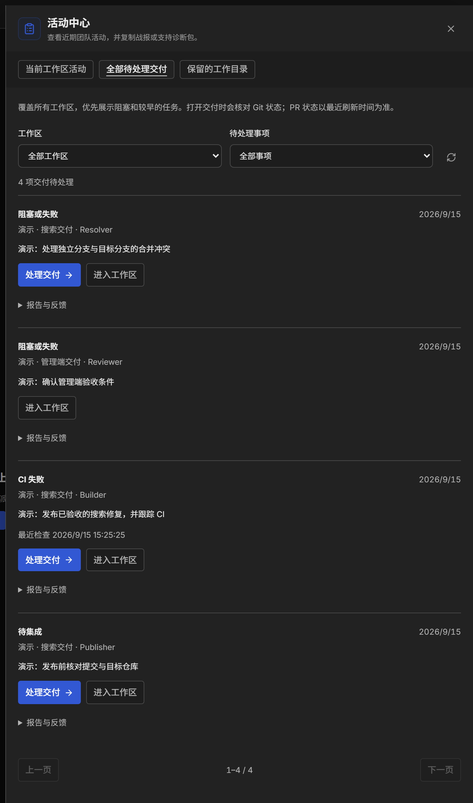
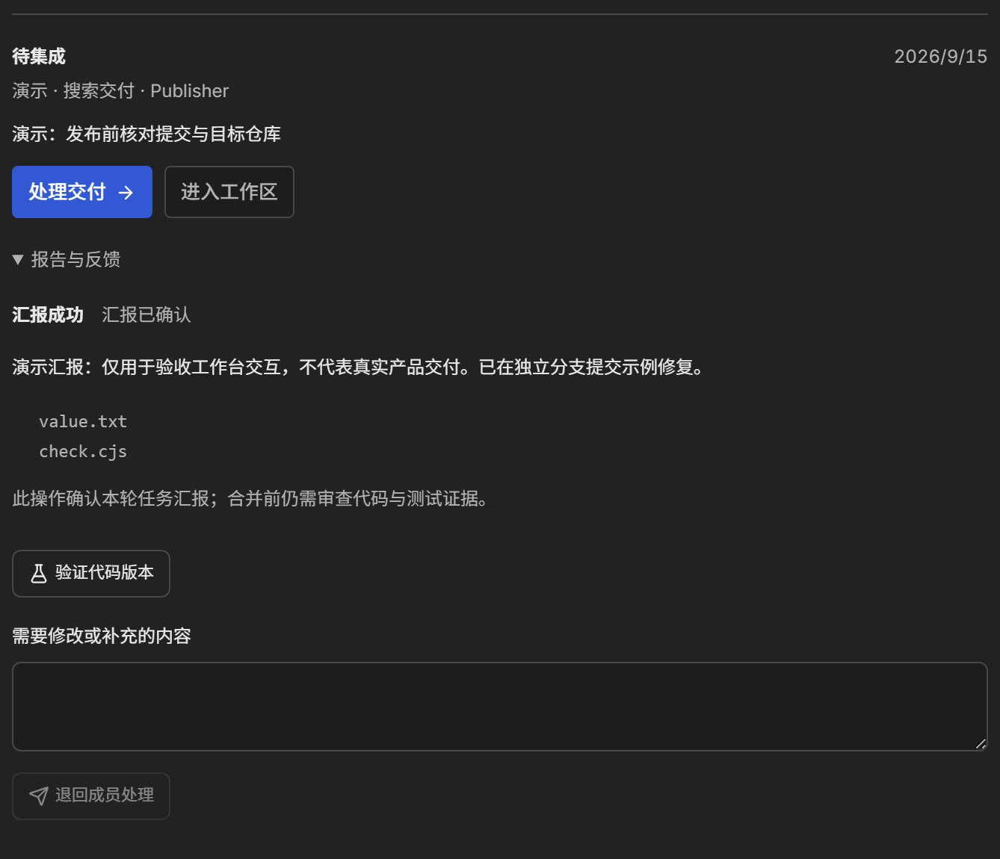
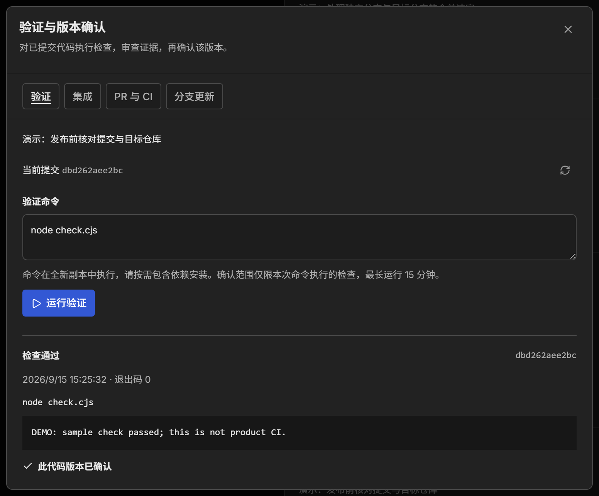
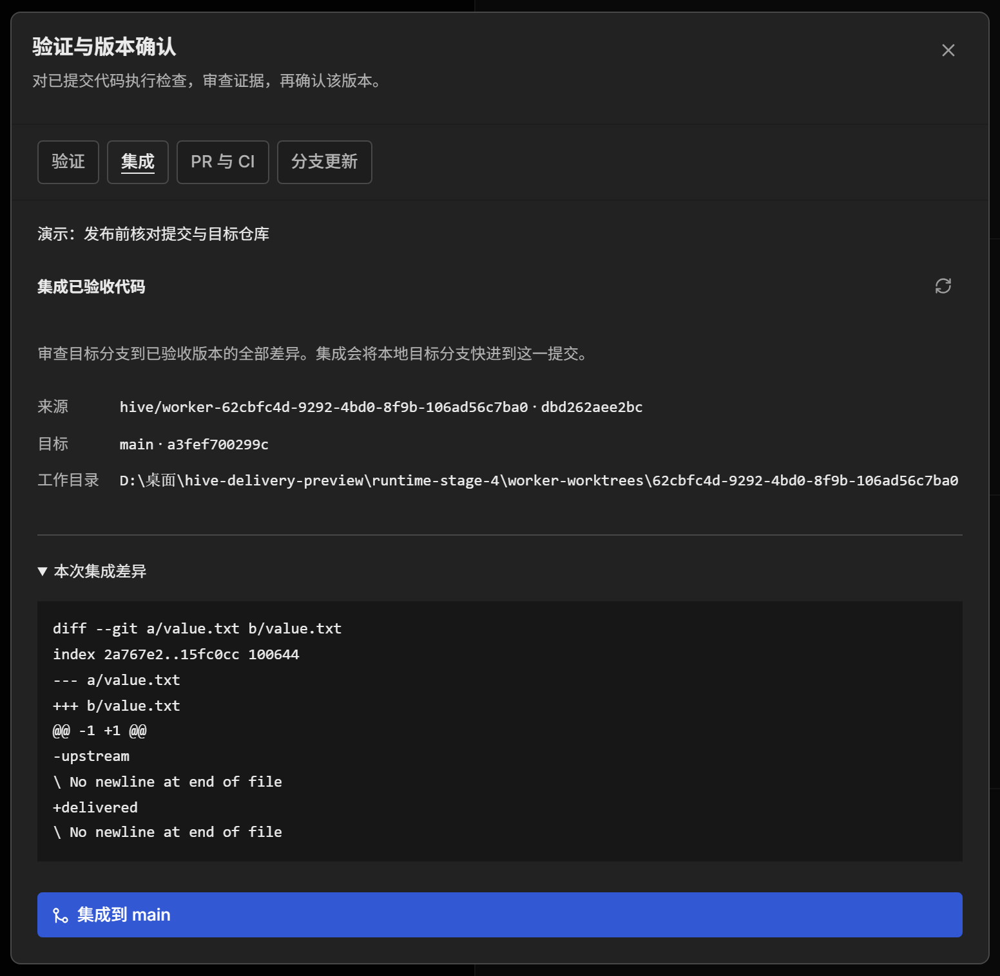
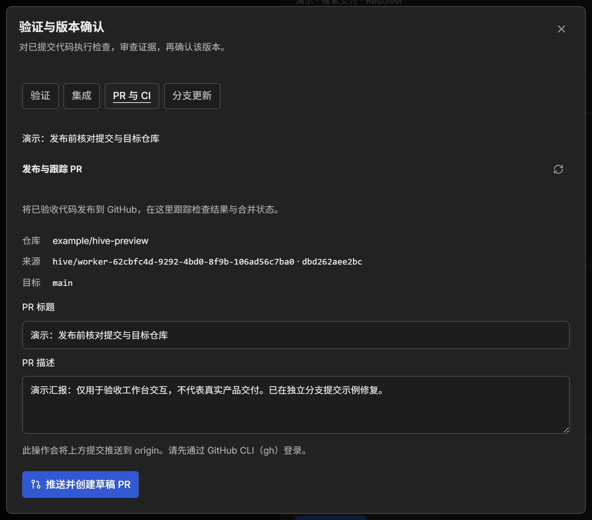
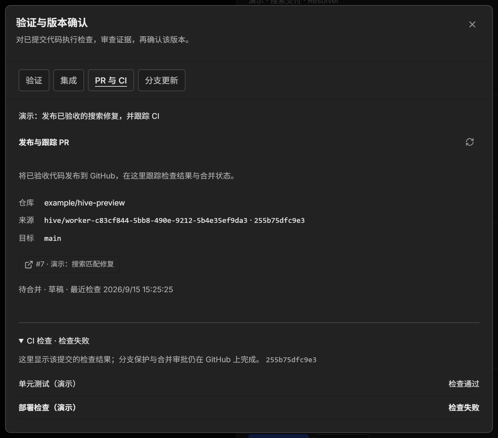
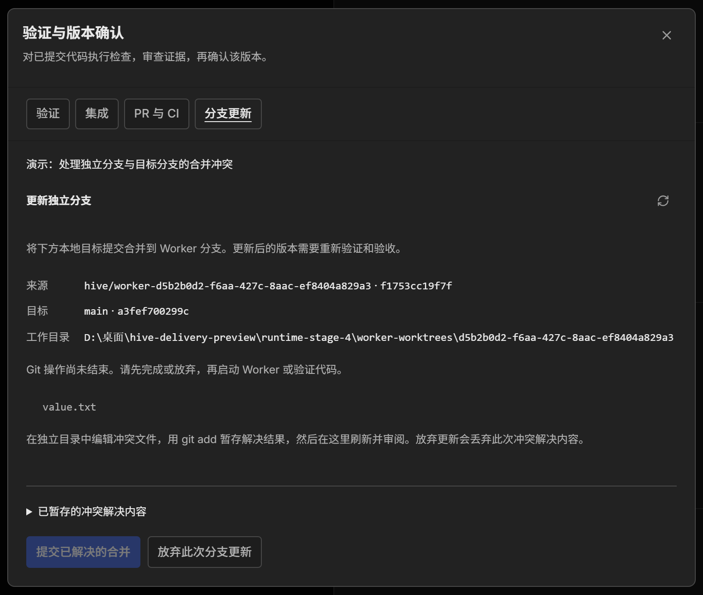
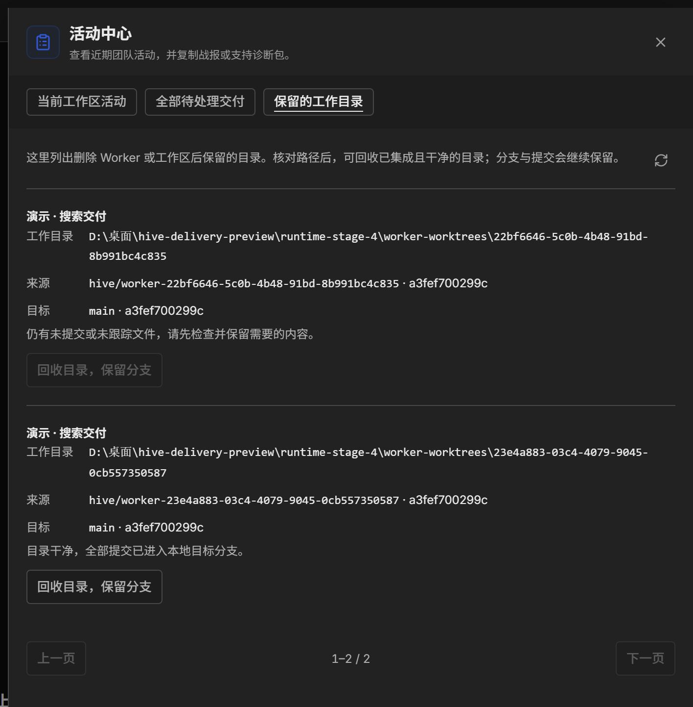

# HiveTeam 交付工作台：从 AI 编码到可验收的代码

功能介绍与上手指南 · 本地验收版 · 2026 年 9 月 15 日

AI 可以同时推进多个开发任务，交付工程师仍然需要回答几个具体问题：谁完成了什么？改动在哪个分支？测试验证的是哪个版本？哪些结果需要我确认？哪些代码已经进入目标分支？

HiveTeam 的交付工作台围绕这些问题，把任务汇报、代码差异、验证证据、人工验收、本地集成和 GitHub PR 连接起来。Claude Code、Codex、Gemini、OpenCode 等 CLI 编码代理仍以真实的 PTY 进程运行，通过团队协议协作；工程师在浏览器中查看过程，并决定何时接受和交付成果。

一次典型交付按这样的顺序推进：**派发任务 → 独立开发 → 提交与汇报 → 验证代码版本 → 人工验收 → 本地集成或 GitHub PR**。遇到反馈、检查失败或分支冲突，就回到对应环节继续处理。

> 本文介绍 `codex/delivery-workbench` 分支已实现、等待人工验收的功能，尚未合并到主干。配图均截取自当前界面的演示工作区；示例任务、PR 和 CI 结果用于说明交互，不代表真实项目已完成交付或发布。

## 先看清当前需要处理什么

工作区顶部的“交付进度”帮助你查看当前项目的近期交付。需要同时管理多个项目时，可以打开 **活动中心 → 全部待处理交付**，集中查看所有工作区的待办，并按工作区、待处理事项筛选。

队列优先展示阻塞和失败事项，同类事项优先展示较早的任务。点击“处理交付”，可以进入相应的验证、集成、PR 或分支处理页面；展开“报告与反馈”，可以直接查看成员的汇报。这样，工程师可以从需要自己介入的事项开始工作。



*图 1 · 同一个队列覆盖多个工作区，任务状态和处理入口放在一起。PR 状态旁的“最近检查”时间说明信息的新鲜程度。*

阅读队列时，需要区分以下几个结果：

| 看到的结果 | 它说明了什么 | 接下来需要判断什么 |
| --- | --- | --- |
| 成员汇报成功 | 成员报告本轮工作已完成 | 是否满足任务要求，是否需要补充或返工 |
| 检查通过 | 指定提交通过了本次验证命令 | 检查范围是否足够，代码是否可接受 |
| 此代码版本已确认 | 工程师接受了这份报告对应的已验证提交 | 选择本地集成还是 PR 交付 |
| CI 检查通过 | 远端对应提交的已观察检查通过 | GitHub 审批、分支保护与合并条件是否满足 |
| 本地集成完成／PR 已合并 | 对应方式的代码合并已经完成 | 是否需要后续发布及目录整理 |

## 从独立开发到有证据的验收

**给并行开发划定清楚的工作范围。** 添加成员时，勾选“使用隔离工作目录”，HiveTeam 会从当前提交创建独立分支和 Git 工作目录。成员的终端进程在该目录中运行，代码改动可以单独检查与验证。


*图 2 · 隔离按成员建立；后续派给同一 Worker 的任务会沿用这条分支。*

例如，你可以让一个成员处理搜索功能，另一个成员修复管理端表单。两项独立任务分别使用自己的工作目录。同一成员承担连续改进时，可以保留分支与上下文；需要独立推进的并行任务则分配给不同成员。安排其他成员审查代码时，应明确告知工作目录和提交，确保审查针对同一份成果。

**把任务结果写成可处理的汇报。** 成员可以通过 `team report` 明确报告成功、失败、阻塞或部分完成，并附上说明与产物路径。工程师在报告中查看结果，需要调整时填写“需要修改或补充的内容”，再点击“退回成员处理”。反馈会重新打开任务，清除原有确认，后续汇报形成新的报告版本。



*图 3 · 报告、产物和反馈入口集中展示。“汇报已确认”表示接受本轮汇报，代码版本仍有独立的验证与确认流程。*

这也帮助工作流更准确地推进：显式成功的汇报可以释放依赖步骤；失败、阻塞或部分完成会暂停推进；未明确结果的旧报告需要人工确认。

**在具体提交上运行检查，再确认版本。** 点击“验证代码版本”，进入“验证与版本确认”。工作台会针对当前 Git 提交创建临时检出目录，运行你填写的验证命令，并保存提交标识、报告版本、命令、时间、退出码和输出。



*图 4 · 每次验收都有具体版本和执行证据。图中的 `node check.cjs` 是演示检查，真实项目应换成自己的质量检查命令。*

如果项目已经配置相应脚本，可以将依赖安装、静态检查、构建和测试组合成一次验证：

```sh
pnpm install --frozen-lockfile && pnpm check && pnpm build && pnpm test
```

临时目录不会复制现有的依赖目录、忽略文件或本地配置，因此命令需要包含必要的准备步骤；单次验证最长运行 15 分钟。检查通过后，工程师审阅代码与输出，再点击“确认此已验证版本”。

验收绑定具体报告和提交。新增提交、未提交改动、重新汇报或后续验证失败，都可能使旧验收不再适用于当前代码，需要处理后重新验证和确认。历史证据会保留。**验证能够证明的范围，取决于你实际运行了哪些检查。**

## 将验收版本交付到目标分支

代码版本确认后，可以按团队习惯选择交付方式。界面中的“集成”和“PR 与 CI”是两个入口。

**本地集成适合在本机完成分支汇合。** 打开“集成”页，核对来源分支、已验收提交、目标分支以及完整差异，再点击“集成到 main”等对应目标分支按钮。工作台使用 Git 快进合并，把本地目标分支推进到验收过的提交。



*图 5 · 集成前可以审查目标分支到已验收版本的全部差异，包括该成员分支上累计但尚未进入目标分支的改动。*

集成要求来源和目标目录干净、相关版本与验收一致；源成员必须停止且没有未完成派单，共享目标目录的代理也需要停止。如果目标分支已经产生分叉，应先在“分支更新”中完成更新，再验证与验收新版本。本地集成完成后，如需远端同步或部署，继续按项目流程执行。

**GitHub PR 适合需要远端审查和 CI 的团队。** 打开“PR 与 CI”，核对仓库、来源提交和目标分支，填写标题与描述，然后点击“推送并创建草稿 PR”。工作台会把已验收的提交推送到成员分支，并创建草稿 PR；已有打开的 PR 可以在新版本验收后继续更新。



*图 6 · 发布前先核对“往哪里交付、交付哪一版”。点击发布按钮会实际推送代码并创建草稿 PR。*

首次使用需要在本机安装并登录 GitHub CLI，同时配置可用的 Git 远端凭据。当前支持 GitHub.com 上通过 `origin` 指向的同仓库 PR。PR 审批和合并由工程师在 GitHub 完成，工作台负责发布已验收版本并跟踪状态。

## 让 CI 失败和分支冲突都有后续动作

PR 创建后，“PR 与 CI”页会显示 PR 链接、草稿或合并状态、最近检查时间，以及对应提交的 CI 检查结果。页面可见时定期刷新，也支持手动刷新。尚无检查、运行中、已跳过、未知、失败和通过会分别呈现。



*图 7 · 示例中单元测试通过、部署检查失败，因此整体仍需处理。检查结果与 PR 提交关联，不能据此推断所有合并审批都已满足。*

当 CI 失败时，工程师可以从待处理队列打开 PR，查看失败项并安排修复。修复产生新提交后，再次验证、验收并更新 PR。队列展示的是最近取得的状态，判断前应留意检查时间。

如果等待验收期间目标分支发生变化，可以打开“分支更新”，将页面预览的**本地目标提交**合并进成员分支。使用前需要先停止该成员，确保没有未完成任务或正在运行的验证，且独立目录干净；远端目标分支的同步按项目既有 Git 流程完成。



*图 8 · 冲突文件和处理位置明确可见。解决结果暂存后，可以刷新查看差异，再提交已解决的合并。*

发生冲突时，在显示的独立目录中编辑文件，用 `git add` 暂存解决结果，然后回到页面刷新、审阅并完成合并。若决定放弃此次更新，当前这次合并的冲突解决内容会被丢弃。未结束的 Git 操作会阻止成员启动、代码验证和发布；完成更新后的新提交需要重新验证与验收。

## 交付结束后，保留成果、回收目录

删除成员或工作区后，独立工作目录会保留。打开 **活动中心 → 保留的工作目录**，可以查看这些目录的来源、目标与回收条件，再决定是否整理。



*图 9 · 含未提交或未跟踪文件的目录会说明阻塞原因；满足条件的目录可以回收，分支和提交继续保留。*

回收需要目录已脱离成员使用、相关进程停止、目录干净，并且全部提交已经进入本地目标分支。笔记等未跟踪文件也需要先处理。GitHub 上采用 squash 合并后，本地历史可能仍不满足这一条件，需要先核对代码与历史。回收由用户手动触发。

## 开始第一次交付验收

准备一个已有提交且没有未提交改动的 Git 项目，确认所选 CLI 能正常启动；独立目录功能要求 Hive 数据目录位于项目之外。随后用一个范围清楚的小任务走完以下流程：

1. 添加成员，勾选“使用隔离工作目录”，派发任务时写明修改范围、完成标准和预期验证方式。
2. 等待成员提交代码并汇报，在“交付进度”或全局队列查看报告、产物与差异；有问题就反馈给成员。
3. 打开“验证代码版本”，执行项目实际需要的检查，审阅输出，再确认这一提交。
4. 选择本地集成或草稿 PR。操作前核对目标与完整差异，并停止相关成员；遇到分支变化先完成更新。
5. 使用 PR 时继续跟踪 CI，在 GitHub 完成审查和合并；完成后按需整理保留的工作目录。

验收时可以重点观察：报告和代码版本是否对应、失败原因是否清楚、反馈后能否继续处理、代码变化后旧确认是否失效，以及实际交付的提交是否就是自己验收的版本。

本文依据交付工作台阶段 1—4 的实现与界面编写。更详细的约束及验收记录见项目 `docs` 目录下的 `delivery-stage-1.md` 至 `delivery-stage-4.md`。
